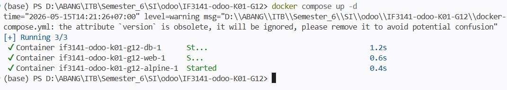
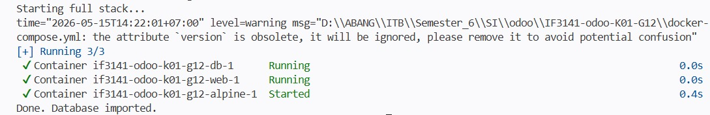
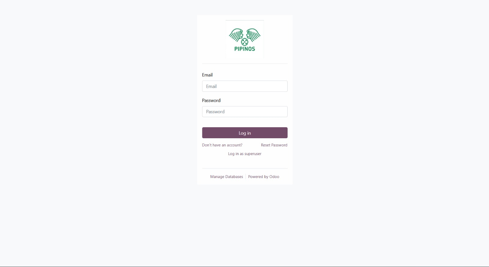
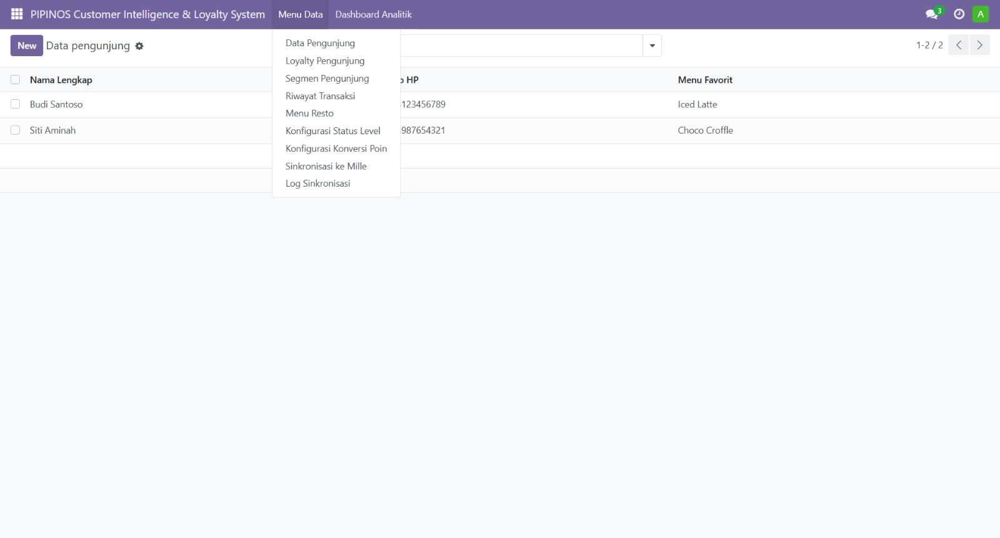
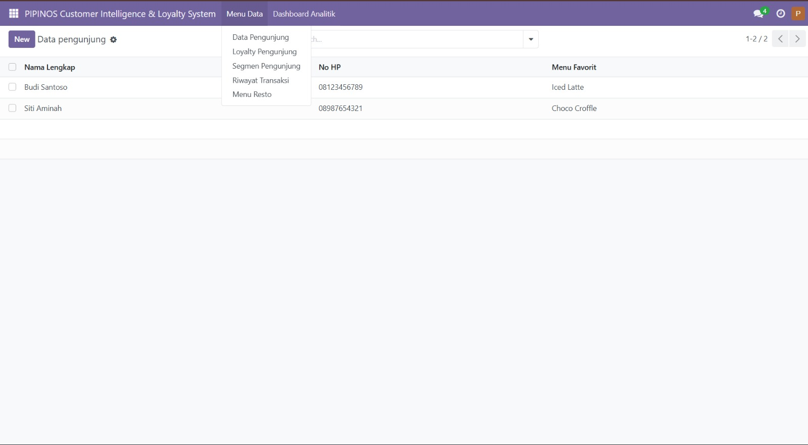

# PIPINOS Customer Intelligence & Loyalty System
### Kelompok G12 | Kelas K01 | IF3141 Sistem Informasi

---

## Identitas Kelompok

| NIM | Nama |
|-----|------|
| 13523001 | Wardatul Khoiroh |
| 13523005 | Muhammad Alfansya |
| 13523006 | William Andrian Dharma T |
| 13523026 | Bertha Soliany Frandi |
| 13523052 | Adhimas Aryo Bimo |

---

## Nama Sistem dan Perusahaan

- **Sistem:** PIPINOS Customer Intelligence & Loyalty System
- **Perusahaan:** PIPINOS

---

## Deskripsi Sistem

PIPINOS merupakan perusahaan Food & Beverage (F&B) dan Hospitality yang beroperasi sebagai bakery-resto dengan nuansa hunian yang nyaman, akrab, dan familiar (konsep homey). PIPINOS menyajikan pilihan roti, kue, pastry, dan hidangan manis ala Eropa ditambah sentuhan lokal serta aneka hidangan bertema New America. Berlokasi di kawasan wisata dan kuliner, PIPINOS menawarkan tempat makan santai dengan pilihan ruang terbuka yang asri. Perusahaan yang dimulai dari sebuah dapur apartemen, kini berkembang menjadi bakery dan restoran yang banyak dikunjungi wisatawan dan mahasiswa.

PIPINOS Customer Intelligence & Loyalty System adalah sistem informasi berbasis Odoo 17.0 yang dirancang untuk mengelola data pengunjung, program loyalitas, dan analitik pelanggan secara terintegrasi. Sistem ini memungkinkan pencatatan demografi pengunjung, pengelompokan segmen pelanggan, pencatatan riwayat transaksi, serta perhitungan poin loyalitas secara otomatis berdasarkan nominal transaksi. Selain itu, sistem mendukung sinkronisasi data dengan sistem eksternal Mille melalui mekanisme webhook dua arah, serta dilengkapi dashboard analitik untuk mendukung pengambilan keputusan bisnis.

---

## Cara Menjalankan Sistem

### Langkah 1 — Jalankan Docker

```bash
docker compose up -d
```



### Langkah 2 — Import Database

```bat
scripts\import_db.cmd
```



### Langkah 3 — Akses Aplikasi

Buka browser, akses `http://localhost:8069`



### Langkah 4 — Login sebagai Admin

- **Username:** `admin`
- **Password:** `admin`



### Langkah 5 — Login sebagai Pelayan

- **Email:** `pelayan@pipinos.com`
- **Password:** `pelayan`



---

## Kredensial Role

| Role | Username / Email | Password | Akses |
|------|-----------------|----------|-------|
| Admin | `admin` | `admin` | Full — semua menu termasuk Konfigurasi Level, Konfigurasi Poin, Sinkronisasi Mille |
| Pelayan | `pelayan@pipinos.com` | *(set manual via Settings → Users)* | Terbatas — Data Pengunjung, Transaksi, Loyalty (read), Dashboard |

---

## Kesimpulan dan Saran

Sistem PIPINOS Customer Intelligence & Loyalty System berhasil diimplementasikan sebagai custom module Odoo 17.0 yang mencakup manajemen data pengunjung, program loyalitas berbasis poin, pencatatan transaksi dengan perhitungan otomatis, serta integrasi data dengan sistem eksternal melalui webhook. Pemisahan akses berdasarkan role Admin dan Pelayan juga berhasil diterapkan sehingga setiap pengguna hanya dapat mengakses fitur sesuai wewenangnya.

Untuk pengembangan ke depan, disarankan agar integrasi dengan sistem Mille diuji secara end-to-end dengan environment Mille yang aktif. Penambahan notifikasi otomatis kepada pelanggan saat poin atau status level berubah dapat meningkatkan nilai bisnis sistem. Validasi input pada form juga perlu diperkuat untuk memastikan integritas data dalam penggunaan produksi.

---

# IF3141 Sistem Informasi - Odoo Setup

## Introduction

Odoo merupakan *Enterprise Resource Planning System* yang mampu melakukan implementasi modul modul kustom untuk menyelesaikan permasalahan proses bisnis pada suatu perusahaan.

Odoo memberikan opsi *on-premise solution* sehingga developer dapat melakukan implementasi kustom modul pada local environment.

Repository ini diperuntukkan untuk Tugas Besar IF3141 Sistem Informasi. Untuk memulai silakan melakukan fork dan membuat repository private untuk workspace setiap kelompok.


## Pre-requisites
Odoo diimplementasikan dengan Python environment dan database PostgreSQL. Repository ini sudah membungkus service aplikasi dan database melalui Docker.

Sebelum memulai, pastikan dependency berikut sudah terpasang:

1. Docker Desktop
	- Download: https://www.docker.com/products/docker-desktop/
2. Python 3.11
	- Digunakan untuk virtual environment (venv) pada proses development modul

## Struktur Direktori

- `/config`
	- Untuk menyimpan konfigurasi Odoo
- `/custom_addons`
	- Tempat pengerjaan modul kustom
- `/dump`
	- Database dump yang dapat diakses scripts untuk proses import/export
- `/scripts`
	- Untuk melakukan database migration
- `docker-compose.yml`
	- Orchestration service Odoo dan PostgreSQL

## Step-by-step Installation

1. Jalankan service Odoo dan PostgreSQL:

	```bash
	docker compose up -d
	```

2. Buka aplikasi pada browser:
	- http://localhost:8069

3. Login menggunakan kredensial default:
	- Username: `admin`
	- Password: `admin`

4. Aktifkan mode developer:
	- Masuk ke **Settings**
	- Nyalakan **Developer Mode / Developer Access**

5. Buat Python virtual environment pada workspace:

	```bash
	python3.11 -m venv .venv
	source .venv/bin/activate
	pip install --upgrade pip
	pip install -r requirements.txt
	```

6. Implementasikan modul pada folder:
	- `custom_addons/`

7. Setelah implementasi modul selesai, lakukan update daftar aplikasi:
	- Masuk ke menu **Apps**
	- Pilih **Update Apps List**

8. Jika melakukan perubahan terhadap isi modul (modifying database), jangan lupa lakukan langkah database migration dengan mengikuti step di heading bawah ini.

## Database Migration

Odoo menggunakan local database pada implementasinya. Maka dari itu dibutuhkan migration system yang dapat dilakukan melakukan **dump db** atau **import db**. Sebelum melakukan migration jangan lupa untuk selalu mematikan service odoo & databasenya dengan menjalankan :

```bash 
docker compose down
```

Apabila terdapat perubahan pada database dan perubahan tersebut ingin diteruskan ke anggota tim lain, lakukan export database terlebih dahulu menggunakan script pada folder `scripts`.

- macOS/Linux:

  ```bash
  ./scripts/export_db.sh
  ```

- Windows:

  ```bat
  scripts\export_db.cmd
  ```

Untuk melanjutkan pengerjaan dari hasil perubahan database rekan tim, lakukan import database terlebih dahulu :

- macOS/Linux:

  ```bash
  ./scripts/import_db.sh
  ```

- Windows:

  ```bat
  scripts\import_db.cmd
  ```